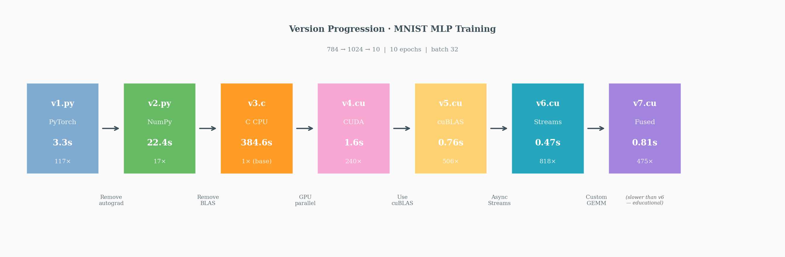
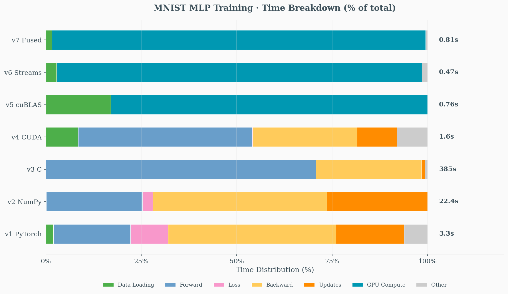

# MNIST in CUDA

This project implements a simple 2-layer MLP for MNIST digit classification, progressively optimizing from high-level PyTorch to low-level CUDA implementations.

- **Architecture:** 784 → 1024 → 10 (input → hidden → output)
- **Dataset:** 10,000 MNIST training samples, batch size 32, 10 epochs
- **Activation:** ReLU | **Loss:** Cross-entropy | **Optimizer:** SGD (lr=0.01)


## Environment

| Property | Value |
|----------|-------|
| Platform | Ubuntu 22.04.5 LTS (GCP) |
| GPU | NVIDIA Tesla T4 |
| CUDA Capability | 7.5 |
| Global Memory | 14930 MB |
| CUDA Version | 12.1 |

## Prerequisites

```bash
# Check Python version
python3 --version

# Check NumPy version
python3 -c "import numpy; print(f'NumPy: {numpy.__version__}')"

# Check PyTorch and CUDA availability
python3 -c "import torch; print(f'PyTorch: {torch.__version__}'); print(f'CUDA available: {torch.cuda.is_available()}'); print(f'CUDA version: {torch.version.cuda}')"

# Check CUDA installation
nvcc --version

# Check GPU info
nvidia-smi --query-gpu=name,compute_cap,memory.total --format=csv
```

## Usage

```bash
cd MNIST-in-CUDA/src

# Download MNIST data (run once)
python3 downloader.py

# v1: PyTorch baseline
python3 v1.py

# v2: NumPy implementation
python3 v2.py

# v3: C implementation
gcc -O2 -o v3 v3.c -lm && ./v3

# v4: Naive CUDA kernels
nvcc -O2 -o v4 v4.cu && ./v4

# v5: cuBLAS optimized
nvcc -O2 -lcublas -o v5 v5.cu && ./v5

# v6: Streams + Pinned Memory + Fusion
nvcc -O2 -lcublas -o v6 v6.cu && ./v6

# v7: Custom Fused GEMM (Educational)
nvcc -O2 -lcublas -o v7 v7.cu && ./v7
```

## Version Progression

### v1.py - PyTorch Baseline
- **Framework:** PyTorch with CUDA tensors. "What should happen" (reference)
- **Features:**
  - High-level PyTorch operations (`nn.Linear`, `nn.ReLU`, `nn.CrossEntropyLoss`)
  - Data pre-loaded to GPU (no per-batch transfers)
  - Custom He initialization for weights (matching NumPy/C implementations)
  - MNIST normalization (mean=0.1307, std=0.3081)
  - `torch.set_float32_matmul_precision("high")` for optimized matmul
  - Detailed timing instrumentation per operation
- **Purpose:** Establishes baseline performance and correctness reference
- **Note:** Slower than raw CUDA due to Python/autograd overhead; T4 lacks TF32 Tensor Cores (Ampere+ only)

### v2.py - NumPy Implementation
- **Framework:** Pure NumPy (CPU-only). "How does it work mathematically" (understanding)
- **Features:**
  - Manual forward/backward pass implementation
  - Custom gradient computation and weight updates
  - He initialization for weights
  - MNIST normalization (mean=0.1307, std=0.3081)
  - Manual softmax with numerical stability (`x - max(x)`)
  - Manual cross-entropy loss computation
  - Detailed timing instrumentation per operation
- **Purpose:** Demonstrates the underlying math without GPU acceleration

### v3.c - C/CPU Implementation
- **Framework:** Pure C with timing breakdown. "How to implement without Python" (low-level)
- **Features:**
  - Manual memory management (`malloc`/`free`)
  - Naive triple-nested loop matrix multiplication (no BLAS)
  - Three matmul variants: `A @ B`, `A @ B.T`, `A.T @ B`
  - He initialization for weights
  - MNIST normalization (mean=0.1307, std=0.3081)
  - Softmax with numerical stability (`x - max(x)`)
  - Binary file I/O for data loading (`fread`)
  - Granular timing breakdown per operation (`clock_gettime`)
- **Purpose:** Shows CPU performance baseline and prepares for GPU porting
- **Note:** Intentionally slow (~90s) — no BLAS/SIMD optimization; same loop structure will parallelize on GPU

### v4.cu - Naive CUDA Kernels
- **Framework:** CUDA C with custom kernels. "How to parallelize on GPU" (optimization)
- **Features:**
  - Custom naive matrix multiplication kernels (no shared memory tiling)
  - Three matmul kernel variants: `A @ B`, `A @ B.T`, `A.T @ B`
  - Element-wise kernels: ReLU, bias, softmax, weight update
  - GPU memory management (`cudaMalloc`/`cudaFree`)
  - Per-batch `cudaMemcpy` transfers (H2D and D2H)
  - Loss computation still on CPU (requires D2H copy)
  - `cudaDeviceSynchronize()` after every kernel
  - CUDA error checking macro (`CUDA_CHECK`)
  - Granular timing breakdown per operation
- **Purpose:** First GPU implementation — direct port of v3.c with parallelization
- **Note:** ~100x faster than v3 due to parallel execution; still inefficient (no cuBLAS, no shared memory)

### v5.cu - cuBLAS Optimized
- **Framework:** CUDA with cuBLAS library. "How to use optimized libraries" (production)
- **Features:**
  - `cublasSgemm` for matrix multiplication (replaces naive kernels)
  - `cublasSaxpy` for weight updates (W -= lr * dW)
  - Persistent memory buffers (no per-batch cudaMalloc/cudaFree)
  - GPU-side softmax + cross-entropy + backward in single kernel
  - Labels stored on GPU (`d_labels`) to avoid D2H transfer
  - Minimal synchronization (only at batch end, not after each kernel)
  - Modular code: `forward_pass_only()`, `backward_pass_only()`, `update_weights_only()`
- **Purpose:** Production-quality implementation demonstrating cuBLAS usage
- **Note:** ~2x faster than v4 due to optimized GEMM; timing simplified to H2D + GPU compute

### v6.cu - Streams & Fusion Optimized
- **Framework:** CUDA with cuBLAS + advanced optimizations
- **Features:**
  - CUDA Streams (`cudaStreamCreate`, 2 streams for double buffering)
  - Pinned host memory (`cudaMallocHost`) for faster DMA transfers
  - Double-buffered device buffers (each stream has own input/output/grad buffers)
  - Async transfers (`cudaMemcpyAsync`, `cudaMemsetAsync`)
  - Fused kernel: `bias_add_relu_kernel` combines bias + ReLU (1 kernel vs 2)
  - Stream-aware cuBLAS (`cublasSetStream`)
  - ~~TF32 Tensor Cores~~ — skipped (T4 is Turing SM 7.5, TF32 requires Ampere SM 8.0+)
- **Purpose:** Hide H2D latency through overlap; reduce kernel launch overhead via fusion
- **Note:** Stream[0] computes batch N while Stream[1] transfers batch N+1

### v7.cu - Custom Fused GEMM (Educational)
- **Framework:** CUDA with custom kernels + cuBLAS hybrid
- **Features:**
  - `fused_gemm_bias_relu_kernel`: Custom tiled GEMM with epilogue fusion (FC1)
  - `fused_gemm_bias_kernel`: Custom tiled GEMM + bias only (FC2, no ReLU)
  - 32×32 shared memory tiles (`TILE_SIZE=32`)
  - Epilogue fusion: GEMM → bias → ReLU in registers, single global write
  - cuBLAS for backward pass only (gradients need accuracy)
  - All v6 optimizations retained (streams, pinned memory, double buffering)
- **Purpose:** Demonstrates how kernel fusion works at the CUDA level
- **Note:** Slower than v6 — shows why cuBLAS/CUTLASS exist (our simple tiling vs. their register tiling, software pipelining, tensor cores)

### v8.cu - Pure FP16 Implementation
- **Framework:** CUDA with cuBLAS GemmEx + native FP16
- **Features:**
  - Pure FP16 throughout: weights, activations, gradients, accumulation
  - `cublasGemmEx` with `CUBLAS_COMPUTE_16F` for native half-precision math
  - No FP32 master weights — true 16-bit training
  - Tensor Core acceleration (FP16 mode)
  - CUDA Streams for overlapped transfer + compute
  - Double-buffered inputs for pipelining
  - Fused bias + ReLU kernels using half intrinsics (`__hadd`, `__hmul`, `__hsub`)
  - GPU-side softmax/cross-entropy/gradient computation
  - Pre-converted FP16 training data for minimal transfer overhead
- **Purpose:** Maximum performance through native half-precision computation
- **Note:** Same speed as v6 TF32 but half the memory footprint; slight precision loss (final loss 0.145 vs 0.142) acceptable for most applications

## Performance Comparison

| Version | Implementation | Time | Speedup vs v3 | Final Loss | Test Accuracy |
|---------|---------------|------|---------------|------------|---------------|
| v1.py   | PyTorch CUDA  | 3.3s  | ~117x        | 0.144      | 93.40%        |
| v2.py   | NumPy CPU     | 22.4s | ~17x         | 0.142      | 93.77%        |
| v3.c    | C CPU         | 384.6s| 1x (baseline)| 0.144      | 92.64%        |
| v4.cu   | Naive CUDA    | 1.6s  | ~240x        | 0.143      | 92.44%        |
| v5.cu   | cuBLAS        | 0.76s | ~506x        | 0.142      | 93.68%        |
| v6.cu   | Streams+Fusion| 0.47s | ~818x        | 0.143      | 93.61%        |
| v7.cu   | Fused GEMM    | 0.6s  | ~641x        | 0.143      | —             |
| v8.cu   | Pure FP16     | 0.3s  | ~1282x       | 0.145      | —             |



## Timing Breakdown Analysis

<table>
<tr>
  <th>Version</th><th>Total</th><th>Data Loading</th><th>Forward</th><th>Loss</th><th>Backward</th><th>Updates</th><th>Other</th>
</tr>
<tr>
  <td>v1 PyTorch</td><td>3.3s</td><td>0.07s (2.0%)</td><td>0.67s (20.2%)</td><td>0.33s (9.9%)</td><td>1.45s (43.9%)</td><td>0.59s (17.9%)</td><td>0.20s (6.1%)</td>
</tr>
<tr>
  <td>v2 NumPy</td><td>22.4s</td><td>0.02s (0.1%)</td><td>5.66s (25.2%)</td><td>0.60s (2.7%)</td><td>10.22s (45.6%)</td><td>5.92s (26.4%)</td><td>0.03s (0.1%)</td>
</tr>
<tr>
  <td>v3 C</td><td>384.6s</td><td>0.00s (0.0%)</td><td>272.2s (70.8%)</td><td>0.00s (0.0%)</td><td>106.4s (27.7%)</td><td>3.38s (0.9%)</td><td>2.61s (0.7%)</td>
</tr>
<tr>
  <td>v4 CUDA</td><td>1.6s</td><td>0.14s (8.5%)</td><td>0.73s (46.3%)</td><td>0.00s (0.1%)</td><td>0.44s (27.6%)</td><td>0.17s (10.7%)</td><td>0.11s (6.8%)</td>
</tr>
<tr>
  <td>v5 cuBLAS</td><td>0.76s</td><td>0.13s (17.0%)</td><td colspan="4" align="center">0.63s GPU compute (83.0%)</td><td>0.00s (0.0%)</td>
</tr>
<tr>
  <td>v6 Streams</td><td>0.47s</td><td>0.01s (2.8%)</td><td colspan="2" align="center">0.21s issue (45%)</td><td colspan="2" align="center">0.24s sync (52%)</td><td>0.00s (0.3%)</td>
</tr>
</table>

**v6 Timing Note:** Due to async operations, timing shows:
- **H2D issue** + **GPU issue**: Time to *queue* async operations (CPU returns immediately)
- **Sync wait**: Time *waiting* for GPU to finish (actual execution)

**"Other" Category:** Unmeasured overhead includes:
- Python interpreter overhead (v1)
- Epoch loop iteration, print statements
- CUDA context initialization (v4)
- Memory allocation outside timed sections




## Performance Insights

- **Memory Management:** Persistent buffers (v5) vs per-batch allocation (v4) significantly impacts performance
- **Library Optimization:** cuBLAS provides highly optimized GEMM operations that outperform naive kernels
- **CPU-GPU Transfer:** Minimizing host-device synchronization is crucial for GPU performance
- **Numerical Stability:** Proper softmax implementation with max subtraction prevents overflow
- **Hardware Utilization:** v5 achieves the best performance by maximizing GPU compute utilization

## Advanced Optimizations

### Implemented in v6
- **CUDA Streams:** 2 streams for overlapping H2D transfer with compute
- **Pinned Memory:** `cudaMallocHost` for faster DMA transfers
- **Double Buffering:** Each stream has own device buffers
- **Kernel Fusion:** Combined bias + ReLU into single kernel
- ~~**TF32 Tensor Cores**~~ — skipped (T4 is Turing SM 7.5, requires Ampere SM 8.0+)

### Implemented in v7
- **Custom Fused GEMM:** Tiled shared memory GEMM with fused bias + ReLU epilogue
- Educational demonstration of why optimized libraries (cuBLAS/CUTLASS) are valuable

### Implemented in v8
- **Pure FP16:** Native half-precision for weights, activations, gradients, and GEMM accumulation
- **cublasGemmEx:** Flexible GEMM API supporting `CUBLAS_COMPUTE_16F` for true FP16 math
- **Half Intrinsics:** Direct use of `__hadd`, `__hmul`, `__hsub`, `__hgt` for element-wise ops
- **Pre-converted Data:** Training data converted to FP16 once at startup, eliminating per-batch conversion

### Potential Future Improvements
- **Unified Memory:** Simplified memory management
- **CUDA Graphs:** Capture entire training step to reduce launch overhead
- **CUTLASS:** Template-based GEMM with true epilogue fusion (requires larger batch sizes)

## Debugging Case Study: v7 Memory Layout Bug

### Symptom
First run of v7.cu showed **exploding loss** and random accuracy:
```
Epoch 0 loss: 2.3795
Epoch 1 loss: 2.4138
...
Epoch 9 loss: 14.3912   ← Should decrease, not increase!
Test Accuracy: 8.05%    ← Random guessing (10 classes)
```

### Analysis

**1. Identify the Problem Type**
- Loss *increasing* = gradients flowing in wrong direction or corrupted data
- ~10% accuracy = model outputting random predictions
- This is NOT a hyperparameter issue — it's a **correctness bug**

**2. Narrow Down the Cause**
- v6 (cuBLAS) works fine → bug is in custom GEMM kernel
- Backward pass uses cuBLAS → bug is in **forward pass**
- Custom kernel computes `Y = A @ B + bias` → check memory layout

**3. Root Cause: Row-Major vs Column-Major Mismatch**

cuBLAS uses **column-major** storage (Fortran convention):
```
Matrix W[M, N] column-major: W[i,j] = W[i + j*M]
```

My kernel assumed **row-major** for weights:
```c
// WRONG: assumed B is column-major [K, N]
Bs[ty][tx] = B[b_row + col * K];  // B[k + hidden * INPUT_SIZE]

// CORRECT: cuBLAS stores W as column-major [N, K] = [HIDDEN, INPUT]
Ws[ty][tx] = W[row + w_col * M];  // W[hidden + input * HIDDEN_SIZE]
```

**4. Additional Issues Found**
- **Bias indexing:** `bias[col]` vs `bias[row]` — bias is per output feature, not per batch
- **Softmax input:** Expected row-major `[batch, classes]`, got column-major `[classes, batch]`
- **Grid dimensions:** Had `(HIDDEN, batch)`, should be `(batch, HIDDEN)` for correct `blockIdx` mapping

### The Fix

Changed kernel convention to match cuBLAS exactly:
```c
// Before: Y = A @ B (A row-major, B column-major with wrong stride)
// After:  Y = W @ X (all column-major, matching cuBLAS)

// FC operation: Y[out, batch] = W[out, in] @ X[in, batch]
__global__ void fused_gemm_bias_relu_kernel(
    const float* W,    // [M, K] column-major (M=out_features, K=in_features)
    const float* X,    // [K, N] column-major (K=in_features, N=batch)
    const float* bias, // [M]    (per output feature)
    float* Y,          // [M, N] column-major
    int M, int K, int N, bool apply_relu
) {
    // W access: W[row, k] = W[row + k * M]
    // X access: X[k, col] = X[k + col * K]
    // Y write:  Y[row, col] = Y[row + col * M]
    // bias:     bias[row] (not bias[col]!)
}
```

### Lessons Learned

1. **BLAS is column-major** — always. When mixing custom kernels with cuBLAS, match their convention.

2. **Check dimensions carefully:**
   - `Y = W @ X` (BLAS style) vs `Y = X @ W` (ML style) have different shapes
   - Grid dimensions must match output layout

3. **Bias is per-feature, not per-sample:**
   - FC layer: `y[batch, feature] = ... + bias[feature]`
   - In column-major: `bias[row]` where `row` is feature index

4. **Debug strategy:**
   - Loss increasing = correctness bug (not tuning issue)
   - Isolate: which pass (forward/backward)? which kernel?
   - Print intermediate values or compare with reference (v6)

## Reference

- [Infatoshi/mnist-cuda](https://github.com/Infatoshi/mnist-cuda)
