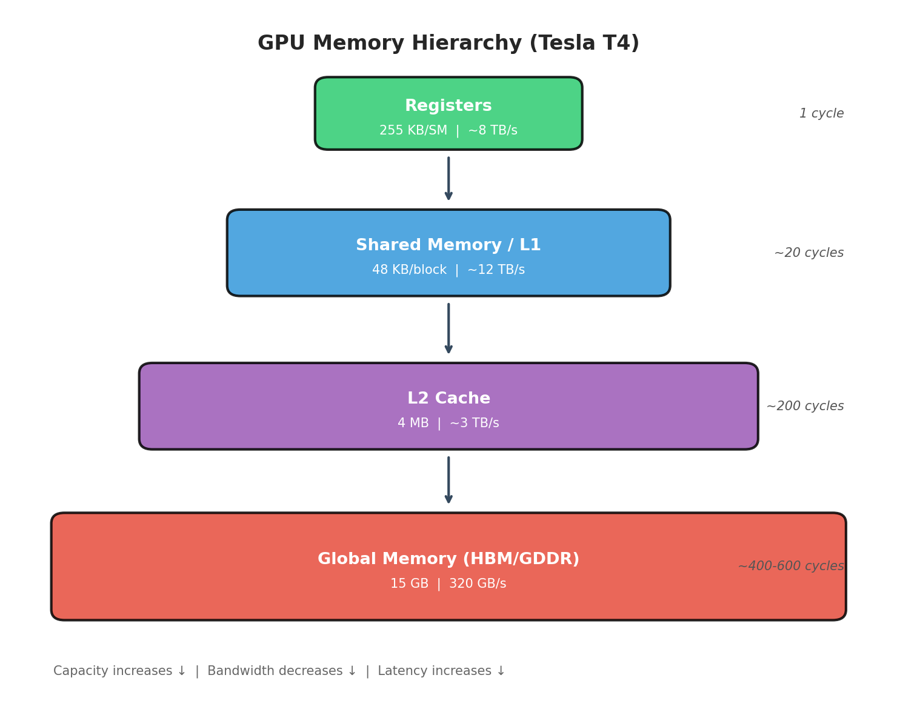
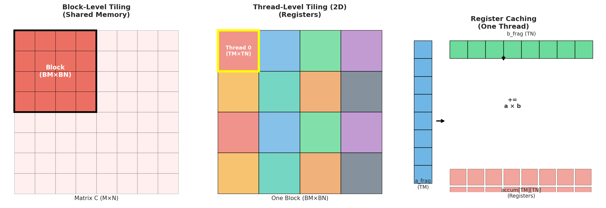
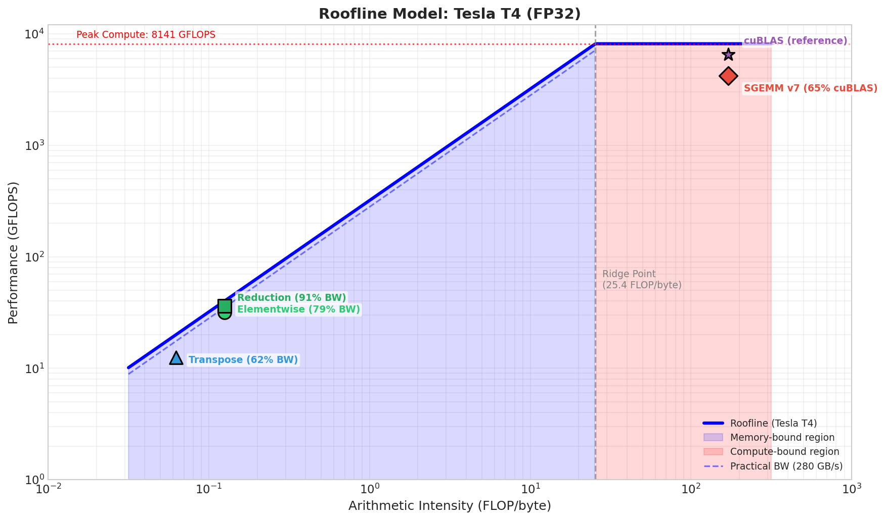
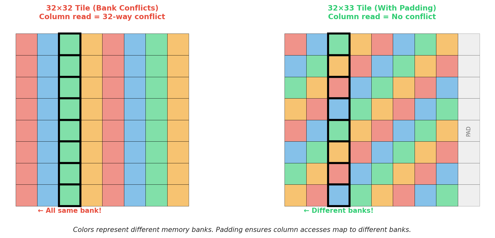
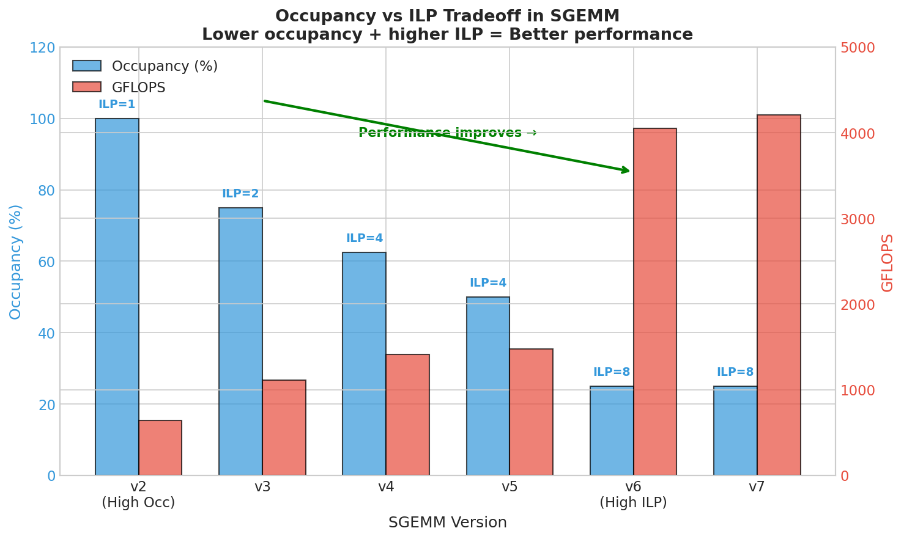

# CUDA Kernel Optimization Playground

A hands‑on exploration of GPU performance through custom CUDA kernel development, with a focus on understanding optimization principles by implementing and systematically improving kernels from scratch.

## Motivation and Design Rationale

Performance on GPUs is governed by efficient data movement through the memory hierarchy and keeping Streaming Multiprocessors (SMs) fully utilized. This project emphasizes learning these principles through practical kernel development rather than relying on high‑level libraries.

### Scope and Intentional Exclusions

This baseline focuses on **FP32 CUDA C++ optimization** with transparent, pedagogical implementations. The following are **intentionally excluded** to keep the optimization path clear:

- **Tensor Cores / WMMA** – Would provide ~2x SGEMM throughput but obscures fundamental optimization principles
- **FP16 / BF16** – Mixed precision doubles effective bandwidth but changes numerical behavior  
- **PTX / SASS assembly** – Low-level tuning deferred to future work
- **Autotuning** – Fixed tile sizes for reproducibility; cuBLAS auto-tunes per GPU

These exclusions are deliberate: the goal is to understand *why* optimizations work, not to replicate library performance.

### Measurement Methodology

All performance measurements follow rigorous methodology:
- **Warmup:** 5 iterations before timing to ensure stable GPU state
- **Timing:** 20 iterations averaged using `cudaEvent` for sub-millisecond precision
- **Problem sizes:** Large enough (32M elements, 1024³ matrices) to amortize kernel launch overhead
- **Correctness:** Verified against CPU reference before any performance measurement
- **Reproducibility:** Fixed random seed, deterministic algorithms

## Environment

| Property | Value |
|----------|-------|
| Platform | Ubuntu 22.04.5 LTS (GCP VM) |
| Device | NVIDIA Tesla T4 |
| CUDA Capability | 7.5 |
| Total Global Memory | 14930 MB |
| Multiprocessors | 40 |
| CUDA Cores per SM | 64 |
| Total CUDA Cores | 2560 |
| GPU Max Clock | 1590 MHz |
| Memory Clock | 5001 MHz |
| Memory Bus Width | 256-bit |
| L2 Cache Size | 4 MB |
| Shared Memory per Block | 48 KB |
| Registers per Block | 65536 |
| Warp Size | 32 |
| Max Threads per Block | 1024 |
| Peak Memory Bandwidth | 320 GB/s |
| Theoretical Peak GFLOPS | ~8,141 (FP32) |

---

# Part 1: GPU and CUDA Fundamentals

- **Execution model**: GPUs consist of Streaming Multiprocessors (SMs), each executing warps of 32 threads in lockstep. Threads are organized into blocks, and blocks form a grid. Control-flow divergence within a warp reduces execution efficiency.

- **Memory hierarchy**: Registers (per-thread, fastest) → shared memory / L1 (per-block) → L2 cache → global device memory (large but high-latency). Performance is largely determined by how effectively global memory traffic is reduced and data reuse is maximized.



*The GPU memory hierarchy spans 4+ orders of magnitude in bandwidth. Optimization is fundamentally about keeping data in faster memory tiers.*

- **CUDA programming model**: Kernels are launched with a grid–block configuration (`<<<grid, block>>>`). Threads within a block can cooperate via shared memory and synchronize using `__syncthreads()`.

- **Streams and concurrency**: CUDA streams enable overlapping of computation and memory transfers to improve hardware utilization.

- **CUDA Graphs**: Kernel launches and dependencies can be captured as a DAG to reduce runtime launch overhead.

- **CUDA libraries**: cuBLAS, cuSPARSE, cuTENSOR, and Thrust provide highly optimized primitives and serve as performance references.

- **Distributed GPU computing**: At scale, multiple GPUs communicate using MPI. GPU-aware MPI allows direct device-to-device transfers without staging through host memory.

---

# Part 2: Foundational Kernel Techniques

Basic GPU kernels are explored to illustrate core optimization principles. Each kernel is implemented, verified, and profiled for performance insights.

- **Element-wise operations** – Vectorized loads (e.g., float4) to maximize memory bandwidth and thread utilization.
- **Reduction** – Warp-level shuffle intrinsics replace global atomics for fast, low-synchronization reductions.
- **Softmax** – Warp-per-row approach fuses max, sum, and normalization in one pass to minimize memory traffic.
- **Matrix transpose** – Shared memory tiling with padding / swizzling ensures coalesced accesses and avoids bank conflicts.

### Pro-Tip: Kernel Fusion

> **In real-world applications (especially deep learning), we rarely launch `Add` then `Sigmoid` separately.** We **fuse** them into a single kernel to avoid the round-trip to DRAM. This is the single biggest optimization for memory-bound operations—it converts two memory-bound kernels into one with the same bandwidth cost but twice the compute.
>
> Example: `y = sigmoid(x + bias)` as one fused kernel instead of `tmp = add(x, bias); y = sigmoid(tmp)`.

---

# Part 3: SGEMM Optimization Case Study

With the foundational techniques established, GEMM serves as a comprehensive case study for performance-critical GPU design. The kernel is progressively optimized:

- **Naive implementation** – Each thread computes one element of C. Simple but suffers from poor memory access patterns and low arithmetic intensity.
- **Shared memory tiling (block-level tiling)** – Tiles of A and B are staged into shared memory to reduce redundant global memory loads and improve coalescing.
- **Register tiling (thread-level tiling)** – Each thread computes a sub-tile (e.g., 8×8) using registers, increasing data reuse and compute efficiency.
- **Double buffering (prefetching)** – Alternates between two buffers to overlap computation with memory loads, hiding latency.
- **Low-level tuning (exploratory)** – Investigates register pressure, bank conflicts, and instruction scheduling to extract additional performance gains.

### SGEMM Tiling Visualization



*Left: Block-level tiling loads tiles of A and B into shared memory. Center: Each block is subdivided into thread tiles (TM×TN) computed by individual threads. Right: Each thread maintains TM×TN accumulators in registers, performing outer products with fragments loaded from shared memory.*

Through profiling and iteration, the GEMM kernel approaches cuBLAS-level efficiency while remaining transparent for learning and experimentation.

---

# Part 4: Performance Results

## Roofline Analysis

The **roofline model** classifies kernels by their bottleneck:
- **Memory-bound:** Performance limited by data movement. Arithmetic intensity < ~25 FLOP/byte on T4.
- **Compute-bound:** Performance limited by ALU throughput. Arithmetic intensity > ~25 FLOP/byte.



*Log-log roofline plot for Tesla T4. Elementwise, reduction, and transpose cluster near the y-axis (memory-bound). SGEMM sits far right (compute-bound). The dashed line shows practical bandwidth ceiling after ECC/controller overhead.*

| Kernel Type | Arithmetic Intensity | Bound | Peak Limiter |
|-------------|---------------------|-------|--------------|
| Elementwise | 0.125 FLOP/byte | **Memory** | Bandwidth |
| Reduction | 0.125 FLOP/byte | **Memory** | Bandwidth |
| Transpose | 0 FLOP/byte | **Memory** | Bandwidth |
| SGEMM | ~170 FLOP/byte | **Compute** | FLOPS |

**Ceiling analysis:**
- **Elementwise/Reduction:** Limited by DRAM bandwidth (320 GB/s), not L2 or instruction throughput. Achievable ceiling ~280-300 GB/s after ECC and memory controller overhead.
- **Transpose:** Limited by read-write asymmetry—each element requires one strided access and one coalesced access, preventing full bidirectional bandwidth utilization. Effective ceiling ~250 GB/s even with perfect tiling.
- **SGEMM:** Limited by FMA throughput. High arithmetic intensity (170 FLOP/byte) means data reuse hides memory latency entirely.

## Summary

| Kernel | Classification | Achieved | Ceiling | Status |
|--------|---------------|----------|---------|--------|
| Elementwise | Memory-bound | 252 GB/s (79%) | ~280 GB/s | ✅ Near optimal |
| Reduction | Memory-bound | 290 GB/s (91%) | ~300 GB/s | ✅ **Optimal** |
| Transpose | Memory-bound | 199 GB/s (62%) | ~250 GB/s | ✅ Good |
| SGEMM | Compute-bound | 4,209 GFLOPS (52%) | ~6,500 GFLOPS | 🔶 Room to grow |

### Bandwidth Efficiency (% of 320 GB/s peak)

```
Reduction v5  ████████████████████████████████████████████████░░  91%
Elementwise   ███████████████████████████████████████░░░░░░░░░░░  79%
Transpose v4  ███████████████████████████████░░░░░░░░░░░░░░░░░░░  62%
              0%       25%       50%       75%      100%
```

---

## Elementwise Operations (32M elements)

**Classification:** Memory-bound (AI ≈ 0.125 FLOP/byte)  
**Efficiency metric:** % of 320 GB/s peak DRAM bandwidth

| Kernel | Time (ms) | Bandwidth (GB/s) | Efficiency |
|--------|-----------|------------------|------------|
| ADD (float4) | 1.597 | 252.1 | **78.8%** |
| SIGMOID (float4) | 1.113 | 241.3 | 75.4% |
| RELU (float4) | 1.149 | 233.6 | 73.0% |

At 73-79% of peak DRAM bandwidth, these kernels are near the practical ceiling. Performance is limited by global memory throughput—not L2 cache, not instruction issue, not compute. Further optimization yields diminishing returns.

---

## Reduction Sum (32M elements)

**Classification:** Memory-bound (AI ≈ 0.125 FLOP/byte)  
**Efficiency metric:** % of 320 GB/s peak DRAM bandwidth

| Version | Intent | Time (ms) | BW (GB/s) | Speedup |
|---------|--------|-----------|-----------|---------|
| v2 | Baseline shared memory | 2.39 | 56.1 | 1.0x |
| v3 | Show atomic contention | 1.27 | 105.8 | 1.9x |
| v4 | Warp-synchronous (`__shfl_down_sync`) | 1.20 | 111.6 | 2.0x |
| **v5** | **float4 + warp shuffle** | **0.46** | **289.7** | **5.2x** |

v5 achieves **90.5% bandwidth efficiency**—essentially at the ceiling for a reduction kernel.

```
Bandwidth (GB/s)    0        100       200       300
                    |---------|---------|---------|
v2 (shared)         ██████░░░░░░░░░░░░░░░░░░░░░░░░  56
v3 (atomic)         ███████████████░░░░░░░░░░░░░░░  106
v4 (shuffle)        ████████████████░░░░░░░░░░░░░░  112
v5 (float4+shfl)    █████████████████████████████░  290  ← 91% peak
                    |---------|---------|---------|
                    0        100       200       300
```

---

## Matrix Transpose (4096×4096)

**Classification:** Memory-bound (AI = 0, pure data movement)  
**Efficiency metric:** % of 320 GB/s peak DRAM bandwidth

| Version | Intent | Time (ms) | BW (GB/s) | Speedup |
|---------|--------|-----------|-----------|---------|
| v0 | Naive baseline | 1.91 | 70.3 | 1.0x |
| v1 | Coalesced writes | 1.81 | 74.2 | 1.1x |
| v2 | `__ldg()` cache | 1.43 | 94.1 | 1.3x |
| v3 | Shared memory tiling | 0.88 | 152.0 | 2.2x |
| **v4** | **Shared + padding** | **0.68** | **198.8** | **2.8x** |
| v5 | Shared + swizzling | 0.68 | 198.8 | 2.8x |

```
Bandwidth (GB/s)    0         50       100       150       200
                    |----------|---------|---------|---------|
v0 (naive)          ███████████████░░░░░░░░░░░░░░░░░░░░░░░░░░  70
v1 (coalesced)      ███████████████░░░░░░░░░░░░░░░░░░░░░░░░░░  74
v2 (__ldg)          ███████████████████░░░░░░░░░░░░░░░░░░░░░░  94
v3 (shared)         ██████████████████████████████░░░░░░░░░░░  152
v4 (shared+pad)     ████████████████████████████████████████░  199  ← 62% peak
                    |----------|---------|---------|---------|
                    0         50       100       150       200
```

At **62% of peak bandwidth**, transpose is limited by the fundamental read-write asymmetry.

### Why Transpose Hits a Lower Ceiling: Bank Conflicts

The transpose kernel cannot achieve the same bandwidth as reduction because:
1. **Read-write asymmetry:** Each element is read once and written once, but in opposite patterns (row-major read, column-major write).
2. **Shared memory bank conflicts:** When threads read a column from a 32×32 shared memory tile, all 32 threads access the same bank—a 32-way bank conflict that serializes access.



*Left: A 32×32 tile causes 32-way bank conflicts when reading columns. Right: Padding to 32×33 shifts each row by one bank, eliminating conflicts entirely.*

**The fix:** Padding a 32×32 tile to 32×33 ensures that columns of the tile map to different shared memory banks, eliminating the 32-way bank conflict during the transposed read. This single change provides ~30% bandwidth improvement (v3 → v4).

---

## SGEMM (1024×1024×1024)

**Classification:** Compute-bound (AI ≈ 170 FLOP/byte)  
**Efficiency metric:** % of cuBLAS throughput (FP32, same hardware)

| Version | Intent | Time (ms) | GFLOPS | % cuBLAS |
|---------|--------|-----------|--------|----------|
| naive | Baseline | 4.74 | 453 | 7% |
| v2 | Shared memory tiling | 3.34 | 643 | 10% |
| v3 | 1D thread tiling | 1.94 | 1,109 | 17% |
| v4 | 2D thread tiling | 1.52 | 1,408 | 22% |
| v5 | Register caching | 1.45 | 1,477 | 23% |
| v6 | Vectorized float4 | 0.53 | 4,052 | 62% |
| **v7** | **Double buffering** | **0.51** | **4,209** | **65%** |
| cuBLAS | Reference | 0.33 | 6,523 | 100% |

### SGEMM Optimization Progression (1024³)

```
GFLOPS        0      1000     2000     3000     4000     5000     6000     7000
              |--------|--------|--------|--------|--------|--------|--------|
naive         ███░░░░░░░░░░░░░░░░░░░░░░░░░░░░░░░░░░░░░░░░░░░░░░░░░░░░░░  453
v2 (shared)   █████░░░░░░░░░░░░░░░░░░░░░░░░░░░░░░░░░░░░░░░░░░░░░░░░░░░░  643
v3 (1D tile)  ████████░░░░░░░░░░░░░░░░░░░░░░░░░░░░░░░░░░░░░░░░░░░░░░░░░  1,109
v4 (2D tile)  ██████████░░░░░░░░░░░░░░░░░░░░░░░░░░░░░░░░░░░░░░░░░░░░░░░  1,408
v5 (reg cache)███████████░░░░░░░░░░░░░░░░░░░░░░░░░░░░░░░░░░░░░░░░░░░░░░  1,477
v6 (float4)   ███████████████████████████████░░░░░░░░░░░░░░░░░░░░░░░░░░  4,052  ← 2.7x jump!
v7 (dbl buf)  ████████████████████████████████░░░░░░░░░░░░░░░░░░░░░░░░░  4,209
cuBLAS        █████████████████████████████████████████████████░░░░░░░░  6,523
              |--------|--------|--------|--------|--------|--------|--------|
              0      1000     2000     3000     4000     5000     6000     7000
```

### Occupancy vs ILP: The Hidden Tradeoff

A common misconception: "Higher occupancy = better performance." In SGEMM, the opposite is often true.



*As we move from v2 to v6/v7, occupancy decreases (fewer active warps per SM) but performance increases dramatically. Each thread does more work (higher ILP), reusing data in registers instead of re-fetching from shared memory.*

**Key insight:** In v6/v7, each thread uses ~128 registers to compute an 8×8 output tile. This limits occupancy to ~25%, but each thread performs 64 FMAs per iteration instead of 1. The register reuse eliminates shared memory traffic, which is the bottleneck in earlier versions.

> **Rule of thumb for compute-bound kernels:** Maximize work per thread (ILP) first, then tune occupancy. Low occupancy with high register reuse beats high occupancy with register spilling.

### Scalability

| Size | v7 GFLOPS | cuBLAS | v7/cuBLAS |
|------|-----------|--------|-----------|
| 512³ | 2,759 | 5,448 | 51% |
| 1024³ | 4,249 | 6,587 | 65% |
| 2048³ | 4,458 | 5,954 | 75% |
| 4096³ | **4,719** | 5,729 | **82%** |

```
v7/cuBLAS ratio vs matrix size

100% ┤
 90% ┤                                        ●──── 82% @ 4096³
 80% ┤                              ●─────────
 70% ┤                    ●─────────  75% @ 2048³
 60% ┤          ●─────────  65% @ 1024³
 50% ┤●─────────  51% @ 512³
 40% ┤
     └────────────────────────────────────────
       512³    1024³    2048³    4096³
```

v7 reaches **82% of cuBLAS at large sizes**—the gap narrows as overhead becomes negligible.

### The Remaining 18%: What cuBLAS Does Better

Reaching 82% of cuBLAS is an excellent result for hand-written CUDA C++. The remaining gap comes from techniques that are difficult or impossible to implement at the C++ level:

1. **Software pipelining with `cp.async`** – On Ampere+, cuBLAS uses asynchronous memory copies (`cp.async`) to overlap global→shared memory transfers with compute more effectively than double buffering alone.

2. **Instruction scheduling** – cuBLAS kernels are often hand-tuned in PTX or SASS to optimize instruction ordering, hiding latency from dependent operations.

3. **Per-GPU autotuning** – cuBLAS selects from dozens of kernel variants based on matrix dimensions and GPU architecture. Our fixed tile sizes (BM=BN=128, BK=8) are good defaults but not optimal for all cases.

4. **Warp specialization** – Advanced kernels dedicate some warps to memory loading and others to compute, achieving better overlap than uniform thread behavior.

> **Bottom line:** If you reach 75-85% of cuBLAS without PTX or tensor cores, you've done extremely well. The last 15-25% requires hardware-specific tuning that libraries amortize across millions of users.

---

## Empirical Conclusions

These are not hypotheses—they are conclusions supported by measurement.

1. **Memory-bound kernels hit the DRAM wall.**
   - Elementwise, reduction, and transpose are all limited by the same ceiling: 320 GB/s DRAM bandwidth.
   - Once a kernel reaches 75-90% of this ceiling, no amount of thread tuning or unrolling will help.
   - The only path forward is algorithmic: kernel fusion, compression, or moving to faster memory (L2, shared).

2. **Compute-bound kernels demand register reuse.**
   - SGEMM performance is determined by arithmetic intensity—how many FLOPs per byte loaded.
   - Tiling to registers (not just shared memory) is the critical optimization; it increased throughput 2.7x from v5 to v6.
   - The occupancy-vs-ILP tradeoff is real: fewer threads with more registers per thread outperforms high occupancy with register spilling.

3. **Four patterns dominate GPU optimization:**
   - **float4 vectorization:** 4x fewer memory transactions, 4x better bandwidth utilization
   - **Warp shuffle:** Eliminates shared memory for intra-warp communication
   - **Shared memory tiling:** Converts strided global access to coalesced access
   - **Double buffering:** Overlaps memory loads with compute, hiding latency

4. **Edge cases are predictable:**
   - Kernel launch overhead (~2μs) dominates for <10K elements—batch or use CPU
   - L2 cache (4MB) causes artificially high bandwidth for working sets <1M elements
   - Non-power-of-two dimensions cost ~1% for transpose (proper bounds checking), ~22% for SGEMM (tile waste)

---

## Next Steps

1. **SGEMM:** Implement WMMA tensor core path (potential 2x)
2. **All kernels:** FP16/BF16 variants (2x throughput, 2x bandwidth)
3. **Reduction:** Multi-pass for >4B elements
4. **Profiling:** Detailed Nsight Compute analysis for register pressure

### Recommended Profiling Resources

For deeper analysis, use **NVIDIA Nsight Compute** to identify hardware-level bottlenecks:

```bash
# Full kernel analysis
ncu --set full -o profile ./build/test_sgemm

# Memory workload analysis (identifies bandwidth, cache, and memory issues)
ncu --section MemoryWorkloadAnalysis ./build/test_sgemm

# Compute analysis (identifies ALU and instruction bottlenecks)
ncu --section ComputeWorkloadAnalysis ./build/test_sgemm
```

Key metrics to examine:
- **Achieved Occupancy** – Are enough warps active to hide latency?
- **Memory Throughput** – What percentage of peak bandwidth is achieved?
- **Compute Throughput** – What percentage of peak FLOPS is achieved?
- **Stall Reasons** – Where are warps waiting? (memory, execution, synchronization)

See the [Nsight Compute Documentation](https://docs.nvidia.com/nsight-compute/NsightCompute/index.html) for detailed metric descriptions.

---

# Repository Structure

```
cuda-kernels-from-scratch/
├── src/
│   ├── elementwise/     # Vectorized add, sigmoid, relu
│   ├── reduce/          # Sum, max, softmax reductions
│   ├── transpose/       # Matrix transpose variants
│   └── SGEMM/           # v1-v7 GEMM implementations
├── tests/               # Correctness + performance benchmarks
├── profiling/           # Nsight Compute/Systems notes
├── figures/             # Generated diagrams (Python + matplotlib)
├── CMakeLists.txt
└── README.md
```

---

# Build & Run

```bash
mkdir build && cd build
cmake ..
make

# Run tests
./test_elementwise
./test_reduction
./test_transpose
./test_sgemm
```

# Profiling

```bash
# Nsight Compute (detailed kernel metrics)
ncu --set full -o profile ./build/test_sgemm

# Nsight Systems (timeline)
nsys profile -o trace ./build/test_sgemm
```

# Generate Figures

```bash
# Requires matplotlib and numpy
pip install matplotlib numpy
python figures/generate_figures.py
```

---

# References

- S. Böhm, [How to Optimize a CUDA Matmul Kernel for cuBLAS-like Performance](https://siboehm.com/articles/22/CUDA-MMM)
- Tongkaio, [CUDA Kernel Samples](https://github.com/Tongkaio/CUDA_Kernel_Samples)
- NVIDIA Developer Talk: https://www.youtube.com/watch?v=86FAWCzIe_4
- Kirk, D. B., & Wen-mei, W. H. (2016). *Programming Massively Parallel Processors: A Hands-on Approach*. Morgan Kaufmann.
- Lei Mao, [CUDA Matrix Multiplication Optimization](https://leimao.github.io/article/CUDA-Matrix-Multiplication-Optimization/)
- Zhihu CUDA Optimization Column: https://www.zhihu.com/column/c_1437330196193640448
- [NVIDIA Nsight Compute Documentation](https://docs.nvidia.com/nsight-compute/NsightCompute/index.html)

---

---

**Baseline checkpoint:** `v1.0-baseline`  
**Hardware:** Tesla T4 (Turing, SM 7.5)  
**Scope:** FP32 CUDA C++, no tensor cores, no mixed precision  
**Date:** December 2024

*Future work (tensor cores, FP16, CUDA graphs) will branch from this baseline.*
